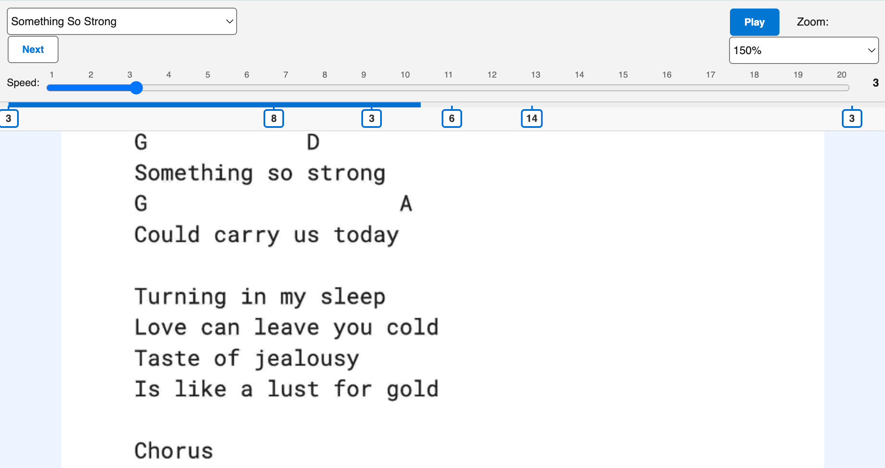
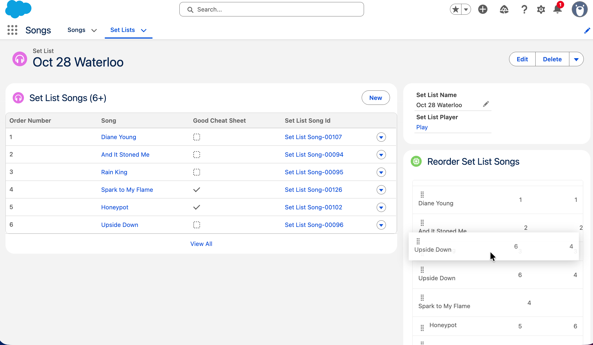
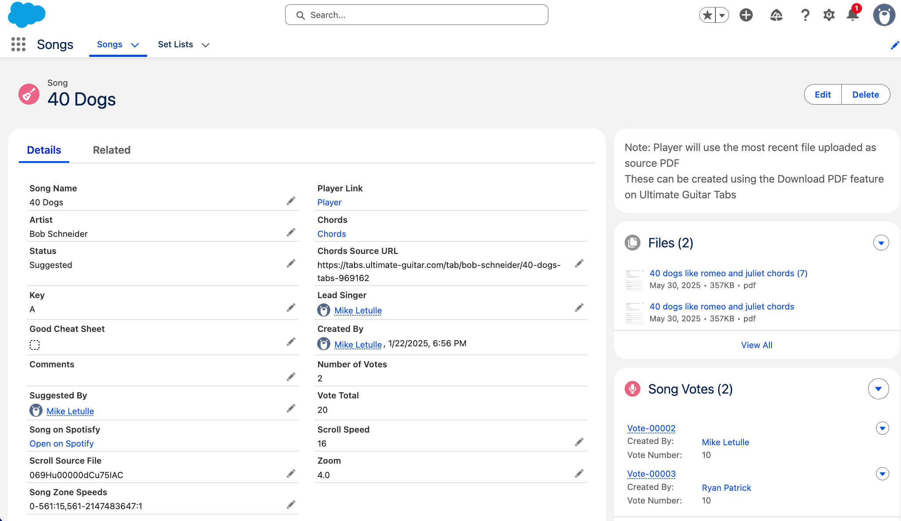

# CoverBand

A Salesforce app for bands to manage chord/lyric sheets with **variable scroll speeds**, set lists, and band collaboration features. Built for chord sheets from sources like Ultimate Guitar Tabs, where different sections often need different scroll speeds.

## Overview

CoverBand lets you:

- **Control scroll speed** – Set different speeds (1–20) for different sections of a song. Verses, choruses, and bridges can each have their own speed.
- **Create set lists** – Build set lists from your song library and reorder them with drag-and-drop.
- **Skip between songs** – Jump to the next song while playing without leaving the player.
- **Collaborate** – Band members vote on which songs to play; the app tracks votes per song.

## How It Works

### Songs & Speed Zones

Each song stores a PDF chord/lyric sheet (attached as a file). You define **speed zones** as percentage ranges (e.g. 0%–25% at speed 5, 25%–75% at speed 12, 75%–100% at speed 8). The player scrolls through the PDF and adjusts speed as it enters each zone.



### Set Lists

Songs are grouped into set lists. You can reorder songs with the drag-and-drop component and save the order. The player loads songs from the set list and lets you move to the next song with one click.



### Voting

Band members vote on songs via the `Song_Vote__c` object. The app calculates vote totals per song to help decide what to play.

### Song Details

Songs store metadata (artist, key, chords source URL, etc.) and the attached PDF. You can open the player from a single song or from a set list.



## Deploy to a Salesforce Org

### Prerequisites

- [Salesforce CLI](https://developer.salesforce.com/tools/sfdxcli) (sf)
- A Salesforce org (Developer, Sandbox, or Production)

### Deploy Steps

1. **Authenticate to your org**

   ```bash
   sf org login web
   ```

2. **Deploy the project**

   ```bash
   sf project deploy start --source-dir force-app/main/default
   ```

   Or deploy to a specific org:

   ```bash
   sf project deploy start --source-dir force-app/main/default --target-org your-alias
   ```

3. **Run tests (optional)**

   ```bash
   sf apex run test --class-names SetListPdfViewerControllerTest,SongPdfViewerControllerTest,SetListReorderControllerTest,SetListSongTriggerTest --result-format human --wait 5
   ```

### Key Pages & Components

| Component | Purpose |
|-----------|---------|
| SetListPdfViewerPage | Player for set list songs (song selector, next button) |
| SongPdfViewerPage | Player for a single song (no set list) |
| setListReorder LWC | Drag-and-drop reorder for set list songs |
